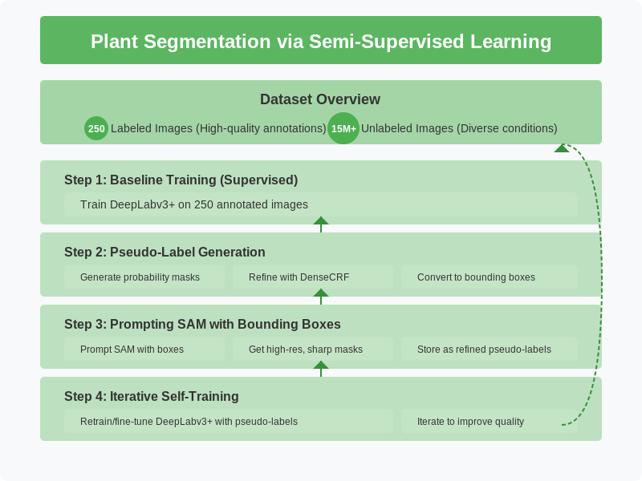

# 🌱 Plant Segmentation via Semi-Supervised Learning and Committee Polling

This project focuses on building a **robust semantic segmentation model** using a small set of annotated images and a massive corpus (15M+) of unlabeled data. We leverage a combination of classical and modern techniques including **DeepLabv3+**, **DenseCRF**, **SAM (Segment Anything)**, and a **committee polling framework** involving **DINO**, **Florence 2**, and **DeepSeek-VL-2**.
<p align="center">
  
</p>
<p align="center">
  
</p>
---

## 📊 Dataset Overview

- **Labeled data**: 250 high-quality annotated plant segmentation masks from 3 regions - East Africa, Haiti, Freetown
- **Unlabeled data**: 15,000,000+ images (in-the-wild, diverse lighting/backgrounds)

Please refer to the notebook 'make_freetown_csv' to get details about how we use a simple sampling method (to adjust for bias) to get a larger corpus for pseudo labels. The distribution we use is given here:
<p align="center">
  
</p>

---

## 🔄 Workflow Overview

### 1. 🔧 Baseline Training (Supervised)
We begin by training a **DeepLabv3+** segmentation model on the 250 annotated images.


---

### 2. 🧪 Pseudo-Label Generation
You can train a checkpoint using the binary_leaf_main.py file. The dataset is available on s3, on treetracker-training-images, with relative path - pilot_annotations/.  
Using the trained DeepLab checkpoint:

- Generate **probability masks** on unlabeled images.
<p align="center">
  
</p>
- Refine masks using **DenseCRF** to improve spatial coherence. You can read more about DenseCRF [here](https://medium.com/@ng2436/why-control-random-field-is-still-relevant-for-post-processing-d99e88556dc2).


- Convert masks into **bounding boxes** for object localization.

<p align="center">
  
</p>

---

### 3. 🧠 Prompting SAM with Bounding Boxes

- Use generated bounding boxes to **prompt SAM** (Segment Anything Model).
- SAM produces **higher-resolution, sharper masks**.
- These are stored as **refined pseudo-labels**.


---

### 4. 🔁 Iterative Self-Training
<p align="center">
  
</p>
- Implement a sophisticated knowledge distillation approach using a combined loss function:
- Cosine Similarity Loss: Aligns the student model's output distribution with SAM's high-quality probability masks
- The combined loss guides the DeepLabv3+ model to learn from both: SAM's high-resolution feature representations and The original ground truth annotations
- Each iteration progressively improves model quality (6% Foreground IOU improvement after first iteration)
- The distillation process effectively transfers SAM's generalization capabilities to the more efficient DeepLabv3+ architecture
<p align="center">
  
</p>
---

## Stratified Sampling from a Large-Scale Image Dataset
#  Background

The production image dataset consists of over 15 million images, hosted behind a REST API. Due to the size of the dataset, it is not feasible to load all data at once, so we access it using offset-based pagination through API queries. Each API call retrieves metadata—including the image_url—for a small number of samples.

How Image URLs Are Accessed
Each image is associated with a numeric offset, and is fetched using the following query pattern:
<pre> ```json { "trees": [ { "image_url": "https://bucket.storage.com/images/img1234.jpg", "label": "banana" } ] } ``` </pre>


## 🧠 Committee Polling for Robust Bounding Boxes

To ensure that only **high-confidence images** are labeled:

### 1. 🔍 Models Used:
- **DINO** (self-supervised vision transformer)
- **Florence 2** (vision-language foundation model)
- **DeepSeek-VL-2** (multimodal reasoning model)

### 2. 🧠 Agreement Strategy:

- Run **DINO + Florence** to generate and compare bounding boxes.
- Filter based on **IoU agreement threshold** and confidence scores.
- Use **DeepSeek-VL-2** to **verify the object class** via text prompts (e.g., *"Is there a plant in this image?"*).


---

## 🔁 SAM Robustness via Perturbed Prompts

To train a more **robust SAM checkpoint**, we introduce **noise and perturbations** in bounding box prompts:

- Slight shifts, scaling, aspect ratio changes
- Simulates real-world imperfect detections
- Encourages SAM to **learn spatial robustness**

### 🔁 Result: A new SAM checkpoint that's **more accurate with noisy boxes**.

---

## 🎯 Final Distillation

You can optionally **distill refined SAM masks** back into DeepLabv3+:

- Train a new DeepLab checkpoint using masks generated by robust SAM.
- Benefit: **lighter, real-time segmentation model** with near-SAM quality.

---

## 📁 Project Structure

